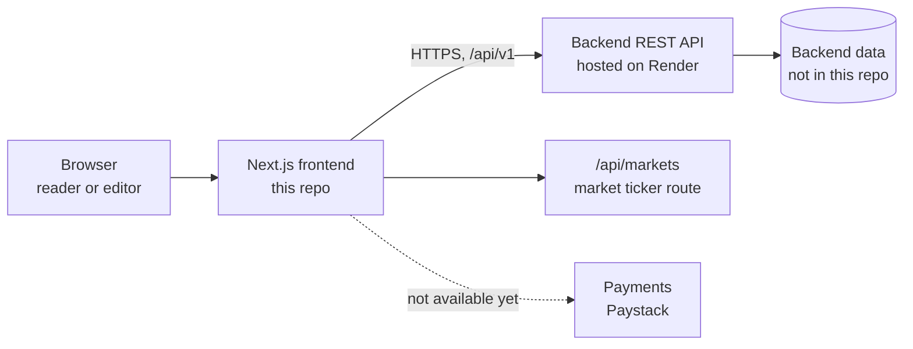
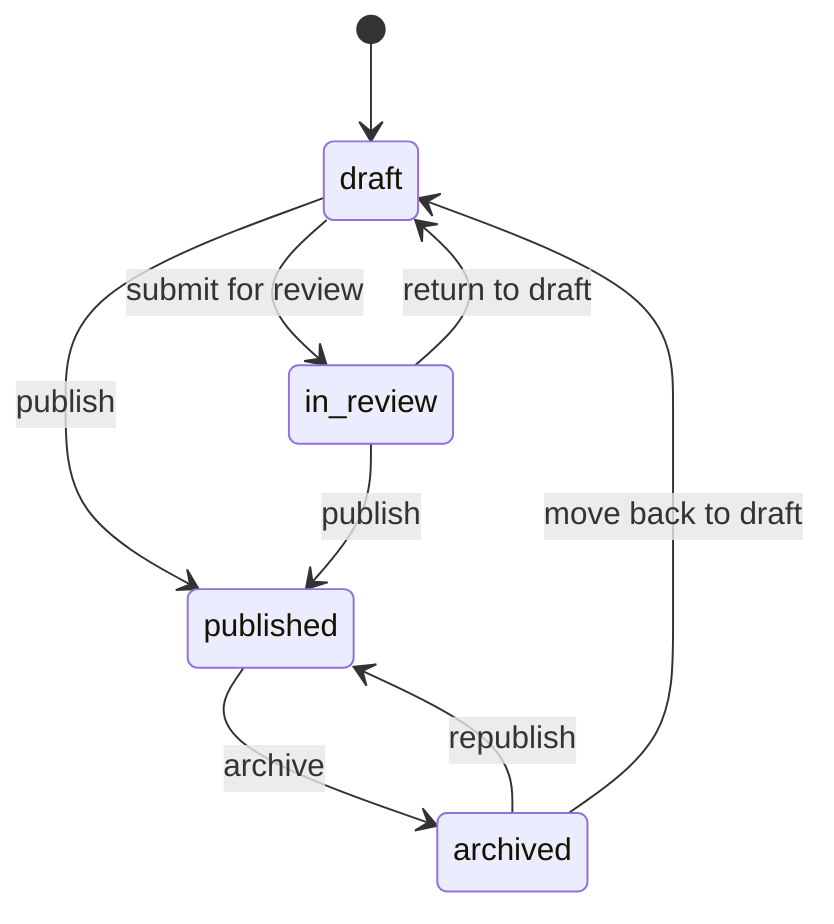

# Jeff's role guide: QA, endpoint testing and frontend

Last updated: 2026-09-18

## Your role at a glance

You are the QA tester and a frontend developer for the Colouresh newsroom, and your first job is to test the backend features that already exist. About 1.5 weeks remain, so testing comes first and frontend work follows once the main flows have been checked.

Your work has four parts, in this order:

1. **Test the CMS endpoints.** Posting articles, confirming and approving drafts, sections and subsegments, and comment moderation.
2. **Create test data.** Articles and accounts for every role, so the reader features can be tested with real data.
3. **Test reader features.** Comments and likes, using the accounts you created.
4. **Frontend work.** Pick up frontend tasks from Sprint 3 onward, agreed with the person leading the UI upgrade.

By the end you should have handed over three things: a completed test matrix (see the phases below), a written list of bugs with reproduction steps, and a set of seeded articles and accounts the team can keep using.

Before you start testing, read the next two sections, "What Colouresh is" and "How Colouresh is built". They explain the product, its name and the architecture, and the test phases make more sense once you have read them.

## What Colouresh is

Colouresh is a Nigerian news platform covering politics, business and security, with free and premium reader tiers, plus a community product called The Seat. It has two audiences in one codebase: readers on the public site, and editorial staff who write and publish through a CMS under `/admin`.

The product was first built under the name EshSpeaks and is being rebranded to Colouresh. You will still meet the old name in a few technical places. These are only labels, so leave them alone:

- the repository folder `eshspeaks-newsroom` (the package itself is already named `colouresh-newsroom`)
- the backend address `eshspeak-backend.onrender.com`
- the browser storage key `esh.refreshToken` and the cookies `esh_at`, `esh_rt` and `esh_csrf`

The rebrand changes how the site looks and what things are called, not how it works. It brings a new colour palette, new fonts, a new button style and new names for the news desks:

| Desk | Route | Covers |
| --- | --- | --- |
| State of Play | `/state-of-play` | Politics and governance |
| The Bag | `/the-bag` | Trade, small business and corporate news |
| Money Moves | `/money-moves` | Markets and the naira |
| The Seat | `/the-seat` | Community topics and threads |

Six more desks (Red Zone, The Vibe, The Whistle, Next Wave, The Brief, Home Ground) are planned and show a coming soon page. The rebrand work lives on the `rebrand/colouresh` branch, where all 18 pages of the design reference are now real routes. There is a separate team catch-up document with the full history since Sprint 1, and this section is the short version.

The frontend has three areas:

- **Articles.** The reader-facing site: homepage, section pages, article pages, likes, comments, ads, account and pricing.
- **CMS.** The admin area under `/admin`: article editor, review and approval, sections, roles, people directory and comment moderation.
- **The Seat.** A community space with topics and threads. It is becoming members only, with an expose landing page for non-members. It has no backend yet.

What matters for you right now:

- The frontend is behind from Sprint 3 onward, and we are catching up.
- There is **no payment API** yet, so the Paystack checkout and pricing pages cannot be tested.
- The backend for The Seat does not exist yet, and its scope was not settled in the latest discussion.

## How Colouresh is built

Colouresh is a Next.js frontend that talks to a separate REST API. This repository has no database and almost no server logic, so every real piece of data, permission and rule lives in the backend, and your API testing is what proves it works.

Read the diagram left to right. A person opens the site in a browser, and the Next.js app fetches data from the backend over HTTPS. Pages get data in two ways: on the server while Next builds the page (used for public lists, which are cached for a minute), and in the browser for anything that depends on who is signed in, such as a single article with its paywall and comments. According to the project notes, the frontend is deployed on Netlify and the backend on Render.

### The stack

| Layer | Choice |
| --- | --- |
| Framework | Next.js 15 with the App Router, React 19, TypeScript in strict mode |
| Styling | Tailwind CSS v4. All design tokens (colours, type, radii, buttons) live in `src/app/globals.css` |
| Server state | TanStack React Query v5, which caches and de-duplicates requests in the browser |
| Fonts | Fredoka for headings, Inter for body text, IBM Plex Mono for metadata and numbers |
| Icons | lucide-react, the only icon library |
| UI primitives | A small set of Radix UI components wrapped in the shadcn style, in `src/components/ui/` |
| Backend | A separate REST API under `/api/v1`, reached through `NEXT_PUBLIC_API_BASE_URL` |
| Tooling | npm, ESLint (`npm run lint`), the TypeScript compiler (`npm run typecheck`) |

The one real server-side route in this repo is `src/app/api/markets/route.ts`, which feeds the market ticker.

### Where things live

All paths are inside the repository root.

| Folder | What is in it |
| --- | --- |
| `src/app/` | Every page. The Next.js App Router lives here, never in a top-level `app/` folder |
| `src/components/` | Interface pieces, grouped by area: `home/`, `seat/`, `admin/editor/`, `layout/`, `auth/`, `account/`, `legal/`, `ui/` |
| `src/hooks/` | React hooks such as `useArticle`, `useComments`, `useArticleLike`, `useSectionsCatalog` |
| `src/lib/api/` | The HTTP client and one small module per feature: articles, comments, sections, roles, users, payments, ads, notifications |
| `src/lib/auth/` | Sign-in, tokens, the session provider and CSRF handling |
| `src/lib/cms/` | The article draft model, status rules and slug helper |
| `src/lib/data/` | Static and mock data: desks, Seat topics, section colours, and the dev-only fallback |
| `src/lib/dev/` | The dev-only role and tier preview switcher |
| `public/colouresh/` | The static design reference (18 HTML pages, colours and a style guide). Read only |
| Root documents | `CLAUDE.md` (rules), `ARCHITECTURE.md` (detail) and `PROJECT-STATUS.md` (latest snapshot) |

### The three route groups

| Group | For | Pages |
| --- | --- | --- |
| `(public)` | Readers | The homepage, desk and section pages, articles, The Seat, topics and threads, account, pricing, and the company and legal pages. An article lives at `/{section}/{subsegment}/{slug}` |
| `(auth)` | Signing in | `/login`, then `/verify`, then `/username` |
| `admin/` | Editorial staff | `/admin`, `/admin/articles` (with the editor), `/admin/sections`, `/admin/roles`, `/admin/users`, `/admin/moderation` |

The admin area checks the signed-in role in the browser and redirects to `/login` if it is missing. That check only avoids showing admin screens to the wrong person. It is not a security boundary, because the backend re-checks every write. This is why testing permissions directly against the API matters.

### How a page gets its data

Every request to the backend goes through one HTTP client, `src/lib/api/client.ts`. Knowing what it does explains most of the behaviour you will see while testing.

1. **It unwraps the response envelope.** Every reply is `{success, data, message, errorCode}`, and failures also carry `appErrorCode`. The client returns `data`, or throws a typed error.
2. **It attaches the Bearer token** when the call needs sign-in.
3. **It retries once on a `401`.** It refreshes the token, then repeats the request. If the refresh fails too, the session is treated as dead and the person is signed out.
4. **It sorts failures into kinds:** network, unauthorized, forbidden, not found, conflict, validation, rate limited and server.

On top of the client sit small feature modules, one function per endpoint, in `src/lib/api/`. Adapters in `adapters.ts` then convert the raw API shape into the shape the screens use, for example `toUiArticle()`.

Caching is why a change sometimes takes a moment to appear:

| What | Cached for | Where |
| --- | --- | --- |
| Section list and single sections | 5 minutes | Next.js server cache and React Query |
| Article lists (home, section, subsegment) | 60 seconds | Next.js server cache |
| Most other browser requests | 60 seconds | React Query |
| Single article by slug, comments, likes | Not cached on the server | Fetched in the browser with the reader's token |

The browser cache does not refetch when you return to the tab, and it stops retrying on rate limit, unauthorized and forbidden errors so it does not hammer the backend. The section list is cached this heavily because it once caused `429` rate limit errors when many components asked for it at the same time.

### How sign-in works

There are two kinds of session, and they behave differently.

- **Email code sign-in** returns Bearer tokens in the response. The access token is held only in memory, so a page reload discards it. The refresh token is stored in the browser's `localStorage` under `esh.refreshToken`. On every page load the app uses that refresh token to get a new access token, then calls `GET /auth/me` to learn who the user is. It also refreshes about a minute before the access token expires.
- **Google sign-in** is a full-page redirect that returns no tokens in the body. It runs on cookies (`esh_at` and `esh_rt`) that the backend serves with `SameSite=None`, so they work across the two hosts. Every write from this kind of session must also send an `X-CSRF-Token` header that echoes the `esh_csrf` cookie, or the backend replies `403 CSRF_TOKEN_INVALID`. The app adds that header automatically.

After sign-in, `useAuth()` gives every screen the user, the session status, `hasRole()` (which respects the ladder, so a chief editor passes a contributor check) and `isSubscriber` (true when `membershipTier` is `PREMIUM`). A session that dies in the background now signs the user out at once and sends them to `/login`, returning them to the page they were on afterwards.

### How the CMS works

The article editor is a rich-text editor whose body is stored as HTML. It behaves like this:

- **Autosave is local only.** While someone types, the draft is saved to the browser's `localStorage`, and nothing is sent to the backend. A draft can therefore exist in the editor without existing on the server.
- **Saving is explicit.** The first submit creates the article with `POST /articles`. After that, "Save changes" sends `PATCH /articles/{id}`.
- **Status has its own call.** Submitting, publishing, archiving and returning to draft all go through `PATCH /articles/{id}/status`, and the buttons offered depend on the role. The backend makes the final decision.
- **Editing an existing article** loads it by slug, because there is no fetch by id. That is why the editor URL carries a slug or a local draft id.

### Mock data and development switches

Two things can make the app show something that did not come from the real backend. Know them so they do not fool you.

| Switch | What it does | For you |
| --- | --- | --- |
| `NEXT_PUBLIC_USE_MOCK_DATA=true` | Fills the homepage, section pages and article pages with 124 mock articles when the live API returns nothing. Comments are hidden on mock articles | Leave it off while testing |
| Role and tier preview switcher | A development-only control that makes the screens look like a chosen role or tier. It never changes real access and does nothing in production | Do not use it as a substitute for real accounts |

Some data is also always static: the market ticker detail, the people list in the editor's mention menu, and The Seat's topics and threads.

### The Colouresh design system in brief

The look of Colouresh is defined once, in `src/app/globals.css`, and the rules are strict. Frontend changes must follow them.

- **Five colours only.** Orange, green, yellow, purple and red, each with a base, deep, tint and shade. They sit on a warm paper-and-ink base rather than plain white and black. Each section uses one colour as its accent.
- **Buttons** are pills with a flat offset shadow that collapses when pressed. Cards and inputs use corner radii of 12 to 18 pixels.
- **Type:** Fredoka for headlines, Inter for body text and interface, IBM Plex Mono for metadata and numbers.
- **The logo** alone uses a purple-to-slate gradient. It is not a general decorative style.
- **No emojis, no stock photography.** Illustrations are inline SVG, and interface text is in sentence case.

### What this means for your testing

- **Test the API, not only the screens.** The screens hide buttons by role, but only the backend decides what is allowed. Send requests directly to check permissions.
- **Allow for caching.** A new article can take up to a minute to appear on a list, and a section change up to five minutes. A change that never appears is a bug.
- **Check the server, not the editor.** An article in the editor may exist only in that browser's storage. Confirm it with a `GET` request.
- **Know which session you are testing.** Email code sessions use a Bearer token. Google sessions use cookies and need the CSRF header.
- **Keep mock data off,** so every result you see came from the real backend.

## Setup and access

You will test in two ways: through the running app (the `/admin` screens and the public site) and directly against the API with a tool such as Postman. Use the app to check the real flows, and the API to check permissions, bad input and edge cases the UI would never send.

### Run the app

1. Check out the `rebrand/colouresh` branch and run `npm install`.
2. Create `.env.local` and set `NEXT_PUBLIC_API_BASE_URL` to `https://eshspeak-backend.onrender.com`. It is empty by default, and sign-in fails until it is set.
3. Leave `NEXT_PUBLIC_USE_MOCK_DATA` unset while testing. Mock articles would hide real backend results.
4. Start the app with `npm run dev`.
5. Before committing any frontend change, run `npm run lint` and `npm run typecheck`.

All API paths start with `/api/v1`, so the full base for direct calls is `https://eshspeak-backend.onrender.com/api/v1`.

### Sign in with the API

Email code sign-in returns Bearer tokens in the response body:

1. `POST /auth/email/request` with `{ "email": "..." }` sends a code to that address.
2. `POST /auth/email/verify` with `{ "email": "...", "code": "..." }` returns an access token and a refresh token.
3. New accounts then set a username with `POST /users/me/username`. It must be 3 to 30 lower-case letters, numbers or single underscores.
4. Send `Authorization: Bearer <access token>` on every protected call.
5. `POST /auth/refresh` with `{ "refreshToken": "..." }` gets a new access token when the old one expires.

Google sign-in uses cookies instead of Bearer tokens and needs an `X-CSRF-Token` header on every write. Use email sign-in for your API testing, and test Google sign-in only through the browser.

### Test accounts you need

Each account needs its own email address that you can receive mail at. Roles are given by a chief editor, either on `/admin/roles` or with `POST /roles/assign`. The account must have signed in once first. You cannot change your own role, and the last chief editor cannot be demoted.

| Account | Role | Tier | Used for |
| --- | --- | --- | --- |
| Chief editor | `chief_editor` | any | Delete, sections, roles, and the full override checks |
| Section lead | `section_lead` | any | Publish, archive, approve, moderate comments |
| State correspondent | `state_correspondent` | any | Writing and submitting for review |
| Contributor | `contributor` | any | Writing and submitting for review, own work only |
| Reader, free | `reader` | `FREE` | Comments, likes, and the free paywall view |
| Reader, premium | `reader` | `PREMIUM` | Premium article access |

Two things to raise early with the team lead:

- If no chief editor account exists yet, the team lead must promote your first one from the backend side.
- There is no payment API, so a reader cannot buy `PREMIUM`. Ask whoever runs the backend to set that account's tier by hand. Until then, premium checks are blocked.

## Roles, tiers and permissions

There are five roles in a ladder, and the backend is meant to enforce what each can do. The rules below come from notes in the frontend code about the backend contract. Treat them as the expected behaviour you are verifying, and report every place the backend disagrees.

The role ladder, lowest to highest: `reader`, `contributor`, `state_correspondent`, `section_lead`, `chief_editor`. A higher role passes any check meant for a lower one.

| Action | Expected to be allowed | Expected refusal |
| --- | --- | --- |
| Write, edit and submit an article for review | `contributor` and above | `401` without a token, `403` for a reader |
| Publish or archive an article | `section_lead`, `chief_editor` | `403` for contributor and state correspondent |
| Delete an article (hard delete, removes its likes and comments) | `chief_editor` only | `403` for everyone else |
| List your own editorial articles | Any editorial role. A contributor sees only their own work | `403` for a reader |
| Create a section | `chief_editor` only | `403` |
| Edit a section | `section_lead` for their own sections, `chief_editor` | `403` for other sections |
| Delete a section or subsegment | `chief_editor`, and only if it holds no articles | `409` `SECTION_NOT_EMPTY` when it still has articles |
| Assign roles and sections | `chief_editor` | `403`. Also refused: changing your own role, demoting the last chief editor |
| View and moderate the comment queue | `section_lead` and above | `403` |
| Comment, like, send feedback | Any signed-in account | `401` when signed out |

Two separate facts decide what a person sees:

- **Role** decides what they can do in the CMS.
- **Membership tier** (`FREE` or `PREMIUM`) decides whether they can read premium articles. An article has its own `contentTier` of `FREE` or `PREMIUM`. Check paywalls by tier, never by role.

Also know the dev-only role and tier preview switcher in the app. It changes what the screen shows but never real access, so it cannot replace real accounts in your testing.

## Test phase 1: posting articles

Start here. Every other phase depends on being able to create and edit articles reliably. Test each item as the roles listed in the permissions table, and record pass or fail for each role.

The fields an article takes are: `headline`, `slug`, `dek`, `body` (HTML), `sectionId`, `subsegmentId`, `sectorTags`, `contentTier` (`FREE` or `PREMIUM`), `sourceType` (`ORIGINAL`, `CURATED` or `PARTNER`), the featured image fields (`featuredImageUrl`, `featuredImagePublicId`, `featuredImageAlt`, `featuredImageWidth`, `featuredImageHeight`), and the SEO fields (`metaTitle`, `metaDescription`, `canonicalUrl`, `ogImage`). The editor treats `sectionId` and `slug` as required.

### Create: `POST /articles`

- [ ] Create an article with only the required fields, then one with every field filled.
- [ ] Create one article for each `contentTier` and each `sourceType`.
- [ ] Write down exactly what the response contains. The frontend expects an `id`, but the response shape is not documented, so your write-up is useful in itself.
- [ ] Try it with no token, then as a reader. Both should be refused.
- [ ] Leave out `headline`, then `sectionId`, then `slug`. Note the status code and `appErrorCode` for each.
- [ ] Use a `subsegmentId` that belongs to a different section than `sectionId`.
- [ ] Reuse a slug that already exists. Note whether it is refused or renamed.
- [ ] Send an invalid `contentTier` and an invalid `sourceType`.
- [ ] Use a slug with spaces, capitals and punctuation.
- [ ] Put `<script>` tags and inline event handlers in `body`, then open the article on the public site and check that nothing runs.
- [ ] Send a very long `body` and a very long `headline` to find the size limits.

### Edit: `PATCH /articles/{id}`

- [ ] Change each field on its own, then several together, and check the saved article.
- [ ] Send `status` in this request. It should be rejected, because status only changes through its own endpoint.
- [ ] Edit another contributor's article. It should be refused.
- [ ] Edit an article that does not exist.
- [ ] Change the slug of a published article and see what happens to its public URL.
- [ ] Edit a published article as a contributor and note whether it returns to draft or stays published.

### Read: `GET /articles/{slug}`

- [ ] Read a published article signed out, as a free reader and as a premium reader. A `PREMIUM` article should be gated for the free and signed-out reader.
- [ ] Read a draft signed out. It should not be visible. Then read it as its author.
- [ ] Check that `relatedArticles` are returned and are all published.
- [ ] Note that there is no way to fetch an article by its id. That endpoint does not exist yet.

### Lists

- [ ] `GET /articles`, `GET /articles/sections/{slug}` and `GET /articles/sections/{slug}/{subSlug}` return only published articles.
- [ ] Pagination works: `page`, `limit`, `sortBy`, `sortOrder`. The `meta` block (`total`, `totalPages`, `hasNext`, `hasPrevious`) matches the data.
- [ ] `GET /articles/editorial/mine` filters by `status` and `sectionId`. A contributor sees only their own articles, while a section lead and a chief editor see more.

### Images: `POST /articles/images`

Send `multipart/form-data` with a `file` and an `alt` field.

- [ ] Upload a JPG, a PNG and a WebP. Note the returned `url`, `publicId`, `width` and `height`.
- [ ] Upload a very large file, then a non-image file, then a request with no `alt`.
- [ ] Use the returned `url` and `publicId` on an article and check the image displays on the public page.

### Delete: `DELETE /articles/{id}`

- [ ] As a chief editor, delete an article that has likes and comments. Afterwards its slug should return 404 and its comments should be gone.
- [ ] As every other role, the request should be refused.

## Test phase 2: confirming and approving articles

An article moves through four statuses, and `PATCH /articles/{id}/status` is the only way to change one. Your job is to confirm the backend allows exactly the moves below and refuses everything else.

The diagram shows the intended transitions. Only a `section_lead` or `chief_editor` may move an article to `published` or `archived`, or move it out of `archived`. Everyone else may only submit for review and return an article to draft.

Send `{ "status": "in_review" }` (or another status value, lower case) to the status endpoint. Expected outcomes:

| From | To | Contributor and state correspondent | Section lead and chief editor |
| --- | --- | --- | --- |
| `draft` | `in_review` | Allowed | Allowed |
| `draft` | `published` | Refused | Allowed |
| `in_review` | `draft` | Allowed | Allowed |
| `in_review` | `published` | Refused | Allowed |
| `published` | `archived` | Refused | Allowed |
| `archived` | `published` | Refused | Allowed |
| `archived` | `draft` | Refused | Allowed |

### Checklist

- [ ] Walk one article through every allowed move above with the right role, and confirm the status after each with a fresh `GET`.
- [ ] Try every other move and confirm it is refused with a clear status code and `appErrorCode`. Examples: `published` to `draft`, `draft` to `archived`, `in_review` to `archived`, and a move to the status the article already has.
- [ ] Try each restricted move as a contributor and as a state correspondent, and confirm each is refused.
- [ ] Send an invalid status value, a missing status and an upper-case status.
- [ ] Confirm a published article appears on its section page, its subsegment page and the homepage feed. Confirm it disappears from them after archiving or returning it to draft.
- [ ] Check that a section lead can approve articles only in their own sections, and record what happens outside them.
- [ ] Check that `publishedAt` is set on publishing, and note what it does when an article is archived and republished.
- [ ] In the app, open `/admin/articles` as a section lead. Stories in review show Approve and Return to draft buttons. Use them and confirm the status in the list and through the API agree.
- [ ] In the app, open the editor as a contributor and as a section lead, and confirm the buttons offered match the table above.

The editor-to-writer feedback panel and the notification bell call endpoints that do not exist yet. They should show a "pending backend" message and never fake success. Do not log that message as a bug.

## Test phase 3: sections and subsegments

Sections group articles, and subsegments sit inside a section. Every article belongs to a section and may belong to one subsegment, so errors here break article posting too. Test through `/admin/sections` in the app and through the API.

| Endpoint | Method | Purpose |
| --- | --- | --- |
| `/sections` | `GET`, `POST` | List all sections with their subsegments. Create a section with `name`, `slug` and `isSponsored`. |
| `/sections/{slug}` | `GET`, `PATCH`, `DELETE` | Read, edit or delete one section. |
| `/sections/{slug}/{subsegmentSlug}` | `GET` | Read one subsegment. |
| `/sections/{slug}/subsegments` | `POST` | Create a subsegment with `name` and `slug`. |
| `/sections/{slug}/subsegments/{subSlug}` | `PATCH`, `DELETE` | Edit or delete a subsegment. |
| `/roles/sections` | `POST` | Give a user their section assignments (`userId` and `sectionIds`). |
| `/roles/editorial-users` | `GET` | List every account with an editorial role. |

### Checklist

- [ ] `GET /sections` returns every section with its subsegments, and the list is the same on the public site navigation.
- [ ] Create a section as a chief editor, then try as every other role. Only the chief editor should succeed.
- [ ] Create a section with a duplicate name and with a duplicate slug. Note the status code and `appErrorCode`.
- [ ] Create a section with an empty name, a very long name, and a slug with spaces or capitals.
- [ ] Create, edit and delete a subsegment. Check that a subsegment slug can repeat across two different sections.
- [ ] Rename a section or subsegment. In the app the slug now follows the name. Check the new URL works, and check what the old URL returns. Note whether existing published articles still resolve.
- [ ] Edit a section as a section lead who is assigned to it, and as one who is not. Only the assigned one should succeed.
- [ ] Delete a section that still holds articles. It should be refused with `409` and `SECTION_NOT_EMPTY`. Do the same for a subsegment. Then empty it and delete it successfully.
- [ ] Toggle `isSponsored` and check how the section shows on the public site.
- [ ] Assign sections to a contributor, a state correspondent and a section lead with `POST /roles/sections`. The call replaces their whole set, so send `[]` and confirm it clears them.
- [ ] Try to assign sections to a chief editor. The chief editor is global, so this should not be needed or should be refused. Record which.
- [ ] Assign a role with `POST /roles/assign` to an account that has never signed in, then to your own account, then demote the last chief editor. Each should be refused.
- [ ] Confirm a user with no section assignment cannot post into a section they were not given, and record what the error is.

Expect a delay of up to five minutes before section changes appear on the public site, because the frontend caches the section list. Do not report that as a bug, but do report a change that never appears. The navigation labels on the public site are also hardcoded in the frontend, so renaming a section on the backend does not change what the menu says.

## Test phase 4: comment moderation

Comments can be `pending`, `approved` or `rejected`, and section leads and above decide which. Readers post comments through the article page, and editors moderate them at `/admin/moderation`.

| Endpoint | Method | Purpose |
| --- | --- | --- |
| `/articles/{id}/comments` | `GET` | Comments the caller may see: approved ones, plus the caller's own pending ones. |
| `/articles/{id}/comments` | `POST` | Post a comment with `body` and an optional `parentCommentId` for a reply. Requires sign-in. |
| `/articles/comments/moderation` | `GET` | The moderation queue. Defaults to `pending`, oldest first. Filters: `status`, `articleId`, `page`, `limit`, `sortBy`, `sortOrder`. |
| `/articles/comments/{id}/status` | `PATCH` | Set `{ "status": "approved" }` or `{ "status": "rejected" }`. `pending` is not accepted as a target. |

### Checklist

- [ ] Post a comment as a free reader. Note the `status` in the response, and whether it starts as `pending` or `approved`.
- [ ] Read the comments as that reader, as another reader and signed out. The author should see their own pending comment with a "Pending review" badge. Others should not see it.
- [ ] Open the moderation queue as a section lead. The comment should be listed with its article attached, oldest first.
- [ ] Approve it. Now every reader should see it, and the badge should be gone.
- [ ] Reject a different comment. Other readers should not see it. Note what the author sees.
- [ ] Change an approved comment to rejected, and a rejected comment back to approved.
- [ ] Send `pending` as the target status, an invalid status, and a comment id that does not exist.
- [ ] Open the queue and try to moderate as a contributor, a state correspondent and a reader. All should be refused.
- [ ] Filter the queue by `status` and by `articleId`. Check pagination and the `meta` counts.
- [ ] Check whether a section lead sees comments on articles outside their sections, and record it.
- [ ] Reply to a pending comment, then to a rejected one. Note whether the reply is visible and to whom.
- [ ] Post with an empty body, a body of only spaces, a very long body, and a body containing HTML or script tags. The page must show it as plain text and run nothing.
- [ ] Post on an article that does not exist, and while signed out. The second should be refused.
- [ ] Check the moderation screen in the app matches the API for every case above.

## Test phase 5: seed data, then comments and likes

Create the articles and accounts first, then use them to test reader features. The seed data is also a deliverable, because the team will keep using it for demos and later testing.

### Seed data to create

| Data | How much | Why |
| --- | --- | --- |
| Accounts | One per row of the test account table | Covers every role and both tiers |
| Published articles | At least two per section, mixing `FREE` and `PREMIUM` | Section pages, paywall and feed checks |
| Articles in each other status | At least one each in `draft`, `in_review` and `archived` | Approval flow and visibility checks |
| Article with an image | At least three | Image upload and display |
| Article with a subsegment | At least one per subsegment | Subsegment pages |
| Article with a long comment thread | At least one, with replies three levels deep | Threaded comment display |

Write realistic titles and text, since other people will see this content. Do not use offensive or real people's names.

### Comments

Most comment rules are in phase 4. With your seeded accounts, also check:

- [ ] A signed-out visitor who tries to comment is asked to sign in, and returns to the same article after signing in.
- [ ] Replies attach to the right parent, and a reply whose `parentCommentId` belongs to a different article is refused.
- [ ] Threads display correctly on the page: replies nest under their parent, collapse and expand, and the newest and oldest sort orders both work.
- [ ] A comment posted in the app appears at once, and it disappears again with a clear message if the request fails.
- [ ] Comment counts on the page match the number returned by the API.

### Likes and feedback

`POST /articles/{id}/like` toggles a like on and off, and returns `liked` and `likesCount`. Each account can like an article once, and the backend must enforce that.

- [ ] Like an article, then like it again. The second call should remove the like, and `likesCount` should follow.
- [ ] Like the same article from three accounts, and check the count is three.
- [ ] Send two like requests for the same account at the same moment. The count must never go above one for that account.
- [ ] Like while signed out. It should be refused, and the app should ask the visitor to sign in.
- [ ] Like an article that does not exist, and one in `draft` status.
- [ ] The like state and count survive a page reload, and match the API.
- [ ] Deleting an article removes its likes.
- [ ] `POST /articles/{id}/feedback` with `{ "isUseful": true }`, then `false`. Note whether a second answer replaces the first.
- [ ] `POST /articles/{id}/share` with an optional `channel`. The frontend calls it but earlier notes say it may not exist. Record what it returns.

## Do not test yet

Several features are built in the frontend but have no backend behind them. The app is meant to show a "pending backend" state or nothing at all for these, so do not log that as a bug. This list comes from the team's notes, so if you find that one of these endpoints does exist, test it and tell the team.

| Feature | Status | What you will see |
| --- | --- | --- |
| Payments and subscriptions | No payment API. Paystack checkout, the return check on `/account` and the pricing tiers are frontend only | Checkout cannot complete. Prices and the Grey, Slate and Bold tiers are placeholders |
| Fetch an article by id (`GET /articles/{id}`) | Does not exist. Articles are read by slug only | Nothing to test |
| Editor review notes (`/articles/{id}/review-notes`) | Does not exist | The feedback panel shows a pending backend message |
| Notifications (`/notifications`) | Does not exist | The notification bell shows a pending backend message |
| Revision history | Does not exist | Nothing to test |
| Ad slots (`GET /ads/slot`) | Does not exist | Nothing in production, and a labelled box in development |
| People directory (`GET /admin/users`) | May not exist yet | `/admin/users` may show a pending backend panel |
| The Seat topics and threads (`/seat/*`) | No backend. The Seat's scope is still being decided | Topics and threads use static sample data |
| Search, newsletter sign-up, Seat lead forms, admin analytics | Do not exist | Forms do not save anywhere |
| Six desks: Red Zone, The Vibe, The Whistle, Next Wave, The Brief, Home Ground | No page yet | They route to `/coming-soon` |

## Frontend work

After your first testing pass you join the frontend work, while the team lead upgrades the current UI. Agree each task with the lead before starting, so the two of you never edit the same files at once.

The following are candidates, in the order they are likely to matter. Confirm the list with the lead.

1. **Fix frontend bugs you found in testing.** For example wrong error handling, screens that disagree with the API, and permission buttons offered to the wrong role.
2. **Close the Sprint 3 gaps in the articles area.** Compare the comment, like and paywall screens with the API behaviour you verified, and fix the differences.
3. **The Seat expose landing page for non-members.** A short page that explains The Seat and its features. Needs the lead's content and design.
4. **Members-only gating for The Seat topics and threads.** This is blocked until the team decides what counts as a member and whether the backend will provide the topics.

Rules for working in the code:

- The App Router lives in `src/app/`. Never create a top-level `app/` folder.
- Do not edit anything in `public/colouresh/`. It is the read-only design reference.
- Follow the design rules: five colours only (orange, green, yellow, purple, red), pill buttons with the hard shadow, corner radii of 12 to 18 pixels, Fredoka for headings, Inter for body text and IBM Plex Mono for metadata. No emojis, no stock photos, and sentence case for interface text.
- Do not use em dashes anywhere: code comments, interface text, commit messages or documents. Use a comma, a colon, brackets or a new sentence.
- Decide gating by `membershipTier`, never by `role`.
- Send an `X-CSRF-Token` header on writes only through the existing request helpers, and do not add new fetch code around them.
- Run `npm run lint` and `npm run typecheck` before every commit, and work on your own branch from `rebrand/colouresh`.
- Read `CLAUDE.md` first, then `ARCHITECTURE.md` (section 14 lists every endpoint the frontend calls).

## Reporting bugs

Every bug you report should let someone reproduce it without asking you a question. Log each bug in the tracker the team uses, or in one shared spreadsheet if there is none, and use the fields below.

| Field | What to write |
| --- | --- |
| Title | One line: what is wrong and where. Example: "Contributor can publish an article through the status endpoint" |
| Area | Articles, CMS, sections, moderation, comments, likes, auth, or The Seat |
| Endpoint or screen | For example `PATCH /articles/{id}/status`, or `/admin/moderation` |
| Account | The email, role and tier used |
| Steps | Numbered, starting from a signed-in state, with the exact request body |
| Expected | What should happen, with the rule from this document if there is one |
| Actual | What happened: HTTP status, `appErrorCode`, `message` and the response body |
| Evidence | A screenshot for UI bugs, or the request and response for API bugs |
| Severity | One of the levels below |

Every response has the same envelope: `success`, `data`, `message`, `errorCode` and, on failures, `appErrorCode` and `errors`. The `errorCode` is coarse (for example `BAD_REQUEST`, `UNAUTHORIZED`, `NOT_FOUND`, `CONFLICT`). The `appErrorCode` is the specific reason (for example `ARTICLE_NOT_FOUND`, `OTP_EXPIRED` or `SECTION_NOT_ASSIGNED`). Always record the `appErrorCode`, and never rely on the `message` text, which can change.

| Severity | Meaning | Example |
| --- | --- | --- |
| Blocker | A core flow cannot work, or a security rule is broken | A reader can delete an article, or nobody can sign in |
| High | A flow works but gives wrong results, or a permission is wrong | A contributor can publish, or a rejected comment is still public |
| Medium | A flow works with a visible fault or an unclear error | A wrong status code, or an error message that gives no reason |
| Low | Cosmetic or minor | Spacing, wording, or a label in the wrong case |

A useful status code guide: `401` means signed out or an expired token, `403` means the role is not allowed, `404` means not found, `409` means a conflict such as a duplicate or a non-empty section, `429` means rate limited, and `400` or `422` mean bad input. The backend rate limits requests, so space out scripted calls, and record any `429` you hit together with what you were doing.

When you test a case, mark it one of four results: Pass, Fail, Blocked (you cannot test it yet, and say why), or Not tested. Keep the results in the same list as the checklists above, so the team can see coverage at a glance.

Send a short update at the end of each day: what you tested, how many passed, failed or were blocked, the new bugs by severity, and what you plan to do next.

## Schedule and deliverables

You have about 1.5 weeks, which is roughly eight working days from today. Testing takes the first five or six days and frontend work fills the rest. This schedule is a proposal, so agree changes with the team lead.

| Working days | Focus | Output |
| --- | --- | --- |
| 1 | Set up the app and the API tool, create the test accounts, raise the day-one blockers below | Working accounts for every role |
| 1 to 2 | Phase 1: posting articles | Results for every checklist item, first bug list |
| 2 to 3 | Phase 2 (approval) and phase 3 (sections) | Confirmed status rules per role, section results |
| 4 | Phase 4: comment moderation | Moderation results |
| 5 to 6 | Phase 5: seed data, comments and likes. Retest fixed bugs | Seeded articles and accounts, reader feature results |
| 6 | Send the test summary to the team lead | One page: coverage, bugs by severity, open risks |
| 7 to 8 | Frontend tasks agreed with the lead | Committed, linted and type-checked changes |

Raise these on day one, because each can block your testing:

- A chief editor account. Without one you cannot assign roles, create sections or delete articles.
- A premium reader account. There is no payment API, so someone on the backend must set the tier by hand.
- The scope of The Seat. It affects which frontend tasks you can start.
- The exact delivery date. "About 1.5 weeks" is the only figure given so far.

By the end of the period you should have handed over:

- [ ] The completed results for all five test phases.
- [ ] The full bug list, with severity and reproduction steps.
- [ ] The seeded articles and accounts, with a note of which account has which role and tier.
- [ ] The one-page test summary.
- [ ] Your frontend changes, committed on your own branch and passing `npm run lint` and `npm run typecheck`.
